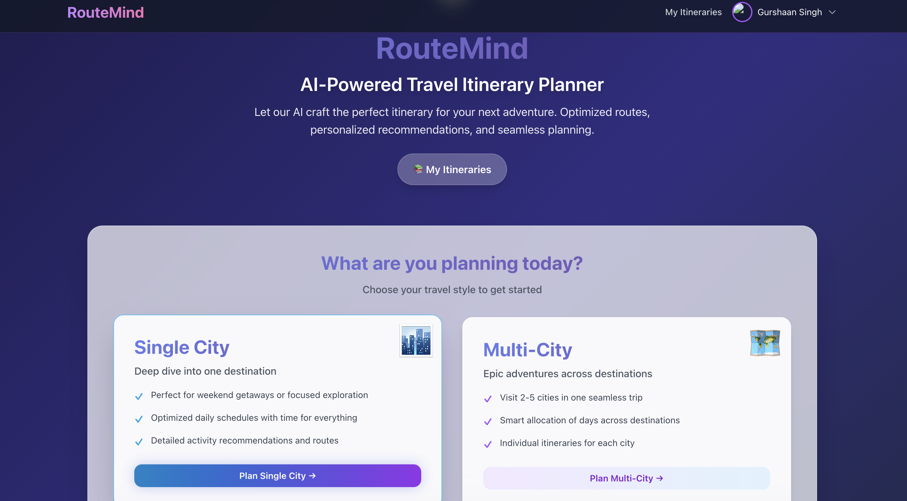
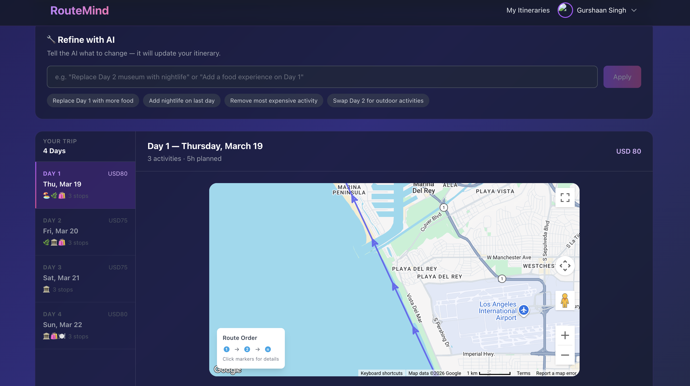
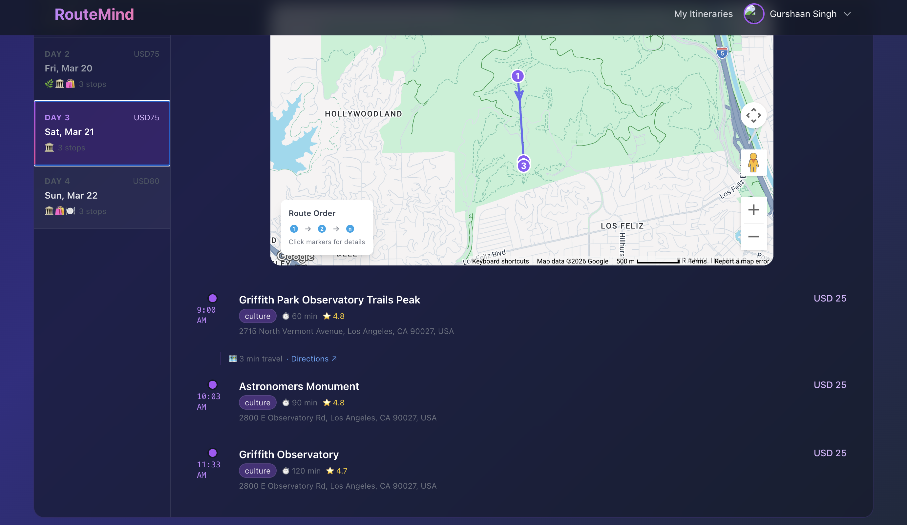
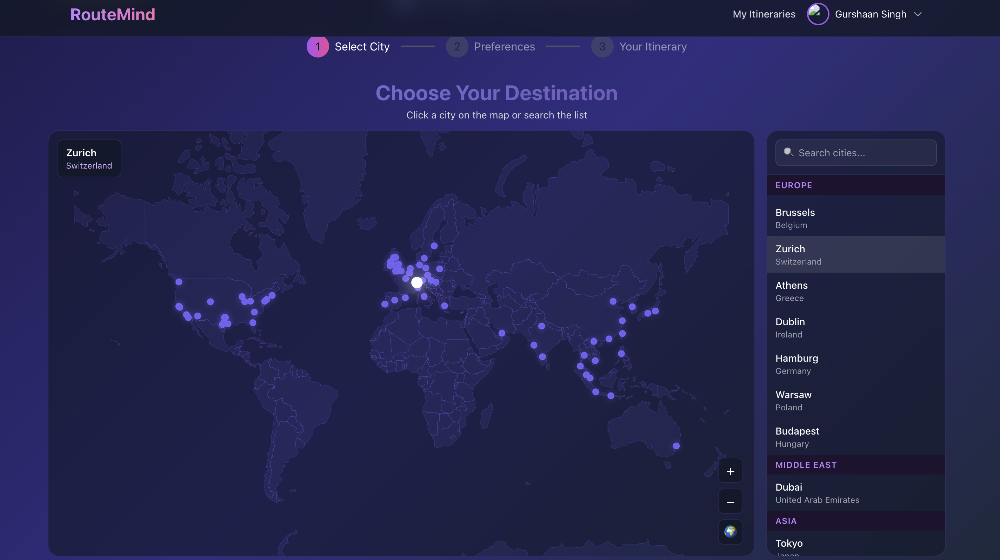

# RouteMind — AI Travel Itinerary Planner

> Generate personalized, day-by-day travel itineraries powered by RAG, constraint optimization, and GPT-4o-mini.

    

---

## What it does

RouteMind takes a city, trip duration, budget, and interests — and produces a complete, optimized travel itinerary. Each plan includes a day-by-day schedule, Google Maps route visualization, an AI-written travel guide, and a natural language refinement interface where users can tweak plans conversationally.

---

## Features

- **AI Itinerary Generation** — GPT-4o-mini writes personalized narratives and travel tips per city
- **RAG-powered Activity Retrieval** — pgvector semantic search surfaces the most relevant activities from a curated DB of 70+ cities
- **Constraint Optimization** — Google OR-Tools schedules activities respecting opening hours, travel time, budget, and pace
- **Multi-City Trip Planning** — Plan 2–5 city trips with intelligent day allocation
- **Refine with AI** — Natural language itinerary editing ("Replace the museum with something for nightlife")
- **Interactive Google Maps** — Route polyline + clickable markers with activity details
- **World Map City Selector** — Interactive globe for destination selection
- **Google OAuth** — Sign in to save itineraries and get higher generation limits
- **Saved Itineraries** — Persistent itinerary storage with shareable public links
- **PDF Export** — Download your itinerary as a PDF
- **Generation Limits** — Redis-backed per-session rate limiting (3/day guest, 5/day authenticated)
- **Session Migration** — Anonymous itineraries migrate to your account on sign-in

---

## Tech Stack

| Layer | Technology |
|---|---|
| **Frontend** | Next.js 14, React 18, TypeScript, Tailwind CSS, Zustand |
| **Backend** | FastAPI, Python 3.10+, SQLAlchemy, Pydantic |
| **Database** | PostgreSQL + pgvector extension |
| **AI / LLM** | OpenAI GPT-4o-mini (narratives + refinement), text-embedding-3-small (RAG) |
| **Optimization** | Google OR-Tools (constraint scheduling), greedy fallback |
| **Caching** | Redis (sessions, generation limits) |
| **Auth** | NextAuth.js + Google OAuth + JWT |
| **Maps** | Google Maps JS API, Google Places API |
| **Infra** | Docker, Docker Compose, Alembic (DB migrations) |

---

## Architecture

```
User Input (city, budget, interests, pace, days)
              │
              ▼
   Next.js Frontend (React + Tailwind)
              │  POST /api/v1/plan-itinerary
              ▼
         FastAPI Backend
              │
     ┌────────┴──────────┐
     │                   │
     ▼                   ▼
RAG Retrieval       Redis Session
(pgvector cosine    (rate limiting +
 similarity →       session tracking)
 top-50 candidates)
     │
     ▼
OR-Tools Optimizer
(constraint scheduling:
 hours, budget, travel time, pace)
     │
     ▼
OpenAI GPT-4o-mini
(AI narrative + travel tips)
     │
     ▼
Structured Itinerary Response
     │
     ▼
Frontend renders:
  ├── Day-by-day activity cards
  ├── Google Maps route + markers
  ├── AI Travel Guide narrative
  └── Refine with AI (conversational editing)
```

**Refinement flow:**
```
User: "Replace Day 2 museum with nightlife"
    → LLM parses intent → RefinementIntent JSON
    → Backend validates against DB / Places API
    → OR-Tools slot-fills replacement activity
    → Updated itinerary returned
```

---

## Quick Start

### Prerequisites
- Python 3.10+
- Node.js 18+
- PostgreSQL with pgvector extension
- Redis
- OpenAI API key
- Google Cloud project (Maps API + OAuth)

### Backend

```bash
cd backend
python -m venv venv
source venv/bin/activate       # Windows: venv\Scripts\activate
pip install -r requirements.txt

# Set up environment variables (see below)
cp .env.example .env

# Run database migrations
alembic upgrade head

# Start server
uvicorn app.main:app --reload --port 8000
```

### Frontend

```bash
cd frontend
npm install

# Create frontend/.env.local with variables listed below
npm run dev
```

App runs at `http://localhost:3000` · API at `http://localhost:8000`

### Docker (optional)

```bash
docker-compose up --build
```

---

## Environment Variables

### Backend (`backend/.env`)

| Variable | Description |
|---|---|
| `DATABASE_URL` | PostgreSQL connection string |
| `REDIS_URL` | Redis connection URL |
| `OPENAI_API_KEY` | OpenAI API key |
| `OPENAI_MODEL` | Model name (default: `gpt-4o-mini`) |
| `EMBEDDING_MODEL` | Embedding model (default: `text-embedding-3-small`) |
| `RAG_ENABLED` | Enable semantic retrieval (`true`/`false`) |
| `RAG_TOP_K` | Candidate pool size for RAG (default: `50`) |
| `GOOGLE_PLACES_API_KEY` | Google Places API key (optional) |
| `JWT_SECRET_KEY` | Secret for JWT token signing |
| `SESSION_SECRET_KEY` | Secret for session management |
| `CORS_ORIGINS` | Allowed frontend origins (JSON array) |
| `ENVIRONMENT` | `development` or `production` |

### Frontend (`frontend/.env.local`)

| Variable | Description |
|---|---|
| `NEXT_PUBLIC_API_URL` | Backend API URL (e.g. `http://localhost:8000`) |
| `NEXT_PUBLIC_GOOGLE_MAPS_API_KEY` | Google Maps JS API key |
| `NEXTAUTH_URL` | App base URL (e.g. `http://localhost:3000`) |
| `NEXTAUTH_SECRET` | Random secret (`openssl rand -base64 32`) |
| `GOOGLE_CLIENT_ID` | Google OAuth client ID |
| `GOOGLE_CLIENT_SECRET` | Google OAuth client secret |

---

## Screenshots

| Home | Itinerary |
|------|-----------|
|  |  |

| Map View | Details |
|----------|---------|
|  |  |

---

## Project Structure

```
RouteMind/
├── backend/
│   ├── app/
│   │   ├── api/          # FastAPI route handlers
│   │   ├── core/         # Optimizer, scoring, auth, cache, session
│   │   ├── db/           # SQLAlchemy models + migrations
│   │   ├── llm/          # OpenAI client + narrative generator
│   │   ├── services/     # RAG, refinement, multi-city, embeddings
│   │   └── websocket/    # Real-time collaboration
│   ├── alembic/          # DB migration versions
│   ├── scripts/          # Embedding generation + RAG evaluation
│   └── tests/            # Unit tests
└── frontend/
    ├── app/              # Next.js app router pages + components
    ├── components/       # Shared components (WorldMapSelector)
    └── public/           # Static assets
```

---

## Built by

**Gurshaan Singh**
[GitHub @Gurshaan10](https://github.com/Gurshaan10) · [LinkedIn](https://linkedin.com/in/gurshaans)
